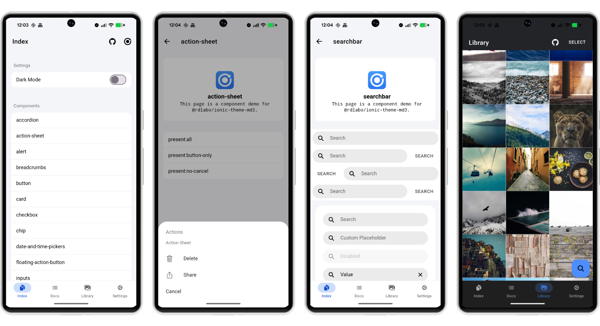

# Ionic Theme Material Design 3

A CSS/JS theme library that applies Material Design 3 design system to Ionic applications.



DEMO is here: https://ionic-theme-md3.netlify.app/

## Overview

This library provides CSS/JS files that bring the Material Design 3 design system to Ionic applications. It updates the look and feel of Ionic components to match the latest Material Design 3 guidelines.

This project aims to follow the core concepts of Ionic as closely as possible, while placing a strong emphasis on compatibility with `@rdlabo/ionic-theme-ios26`. Just as Ionic provides beautiful styling whether it displays the ios or md theme from a single HTML structure, our goal is to ensure that this theme and `@rdlabo/ionic-theme-ios26` are fully compatible.

### Related Projects

If you need a more comprehensive Material Design 3 implementation, you may also be interested in:

- **[md3-for-ionic](https://github.com/danielkleebinder/md3-for-ionic)** by danielkleebinder

> **Note:** This theme is purpose-built for compatibility with Ionic's design approach and `@rdlabo/ionic-theme-ios26`; it is not intended as a strict, full MD3 recreation.


## 💖 Support This Project

Enjoying this library? Your support helps keep it alive and growing!  
Sponsoring means you directly contribute to new features, improvements, and maintenance.

[Become a Sponsor →](https://github.com/sponsors/rdlabo)


## Setup

This is a CSS theme for extending your Ionic project. It does not work on its own, so use it together with the Ionic Framework.

```bash
npm install @rdlabo/ionic-theme-md3
```

And import the theme in your project's main CSS file (e.g., `src/styles.scss`).

```css
@import '@rdlabo/ionic-theme-md3/dist/css/default-variables.css';
@import '@rdlabo/ionic-theme-md3/dist/css/ionic-theme-md3.css';
```

## Development & Testing

### Demo Application

The `demo/` directory contains an Angular application for testing and demonstrating the theme. To run the demo:

```bash
cd demo
npm install
npm start
```

### Visual Regression Testing

We use Playwright for visual regression testing to ensure consistent styling across all components. The test suite automatically captures screenshots of all routes in both light and dark modes.

#### Running Tests

```bash
cd demo

# Run all E2E tests
npm run test:e2e

# Run tests in UI mode (interactive)
npm run test:e2e:ui

# Debug tests
npm run test:e2e:debug

# Update baseline screenshots (when intentionally changing UI)
npm run test:e2e:update
```
