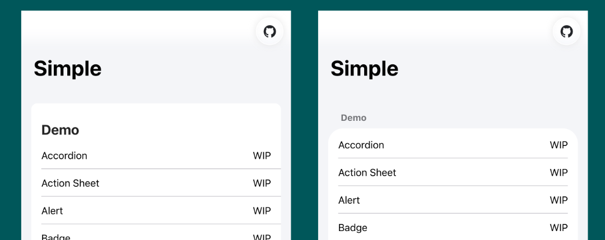

# Using `ion-item-group` with iOS26 Theme

This theme aims to bring Ionic Framework applications as close as possible to iOS 26 design. In most cases, you can use your existing Ionic code as-is, but **only under specific conditions**, you need to add `ion-item-group`.

## When is `ion-item-group` required?

It is only required when **both** of the following conditions are met:

- You have enabled the `inset` property on `ion-list`

Only when these conditions apply, you need to wrap your list items with `ion-item-group`.

## Implementation Example

```diff
  <ion-list inset=true>
    <ion-list-header><ion-label>Label</ion-label></ion-list-header>
+   <ion-item-group>
      <ion-item>...</ion-item>
      <ion-item>...</ion-item>
+   </ion-item-group>
  </ion-list>
```

## Why is this change necessary?

### Background: Challenges in iOS Design Reproduction

By default in Ionic Framework, `ion-list` has a background color, and `ion-list-header` is treated as part of the list. However, with this structure, it's impossible to accurately reproduce **iOS's native design patterns**.



### Solution: Background Color Separation

To faithfully reproduce iOS design, this theme makes the following changes:

- Set `ion-list` background color to transparent
- Delegate background color to `ion-item-group`

This change allows `ion-list-header` to be treated as an independent element, achieving the native iOS appearance.

## Using the Same Design with Material Design

If you want to use the same design pattern with Material Design theme, import the following CSS:

```css
@import '@rdlabo/ionic-theme-ios26/dist/css/md-ion-list-inset.css';
```

This will apply the same `ion-item-group` pattern to the Material Design theme as well.

## Summary

- **Most cases**: You can use your existing Ionic code as-is
- **Specific conditions only**: `ion-item-group` is only required when setting using `inset` on `ion-list`
- **Purpose**: To accurately reproduce iOS 26's native design patterns
